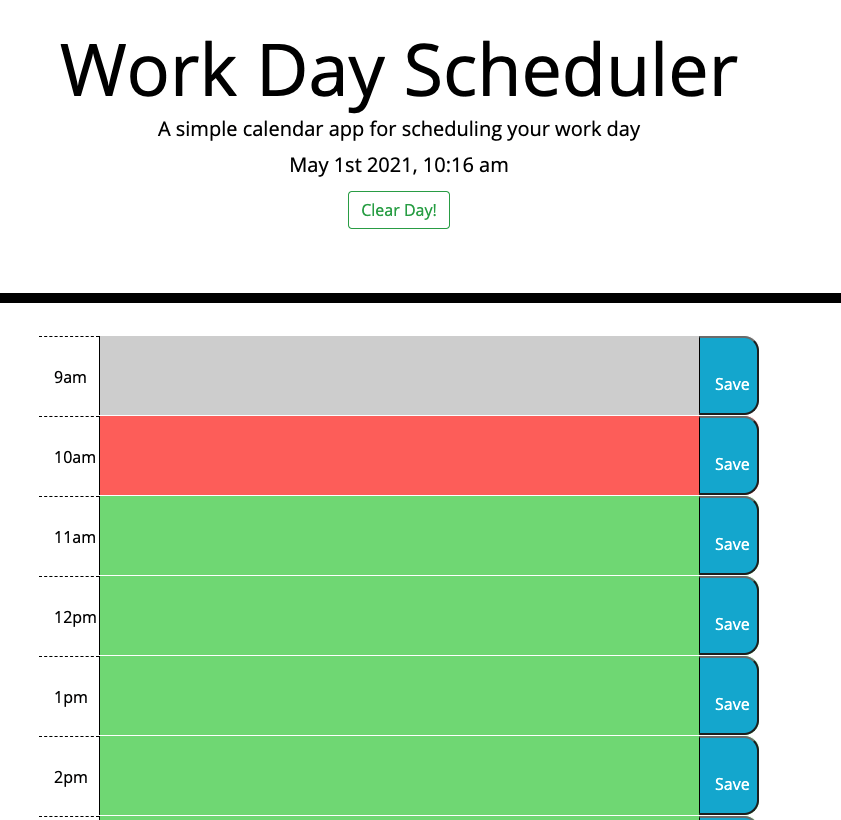
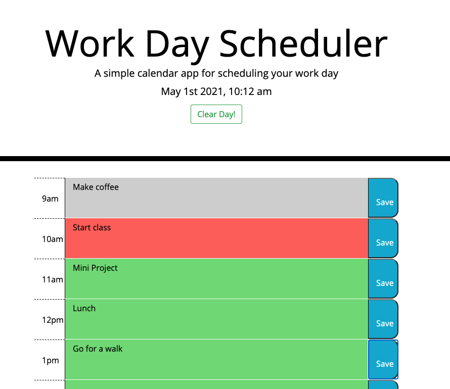

# WorkDay Scheduler

## My Webpage...

A simple calendar application that allows a user to save events for each hour of the day by modifying starter code. This app will run in the browser and feature dynamically updated HTML and CSS powered by jQuery.

Here is my link: [Workday Scheduler](https://savvykolb.github.io/workdayScheduler/)

The following images demonstrate the webpages's appearance and functionality:

